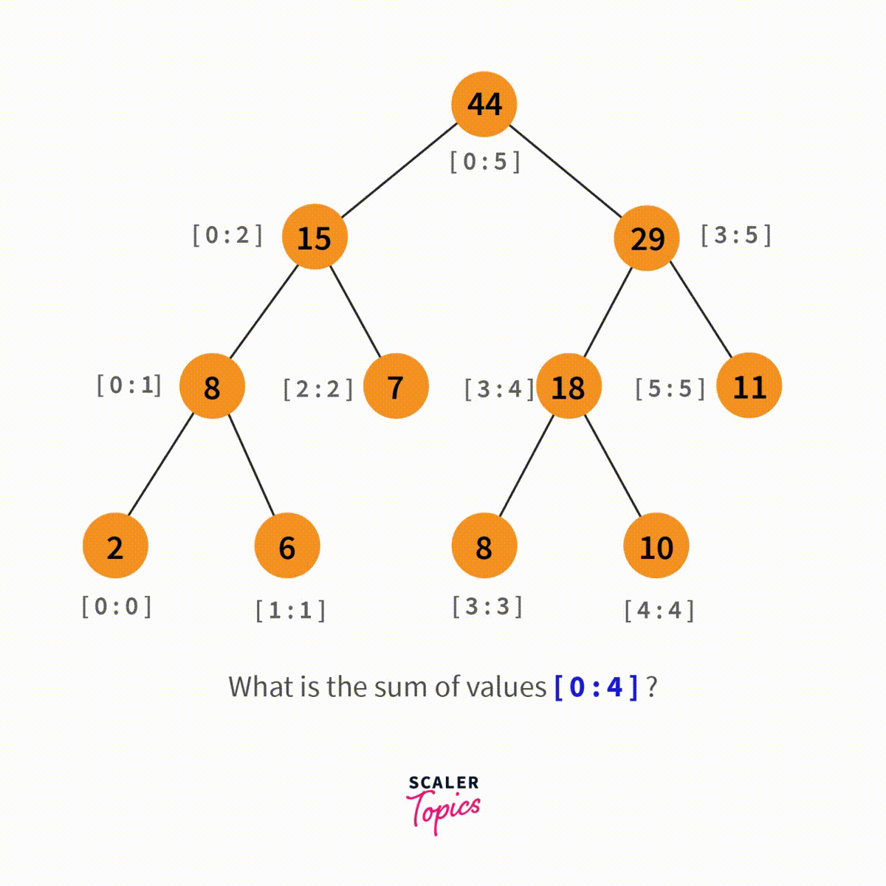
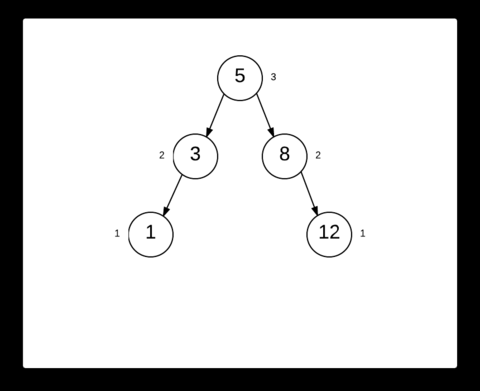

# YouTube
<dl>
<dt>Course Name</dt>
<dd>Algorithmic Problem Solving</dd>
<dt>Course Code</dt>
<dd>23ECSE309</dd>
<dt>Name</dt>
<dd>Chinmayi Halbhavi</dd>
<dt>University</dt>
<dd>KLE Technological University, Hubballi-31</dd>
</dl>

#### Note:
This page hosts:

1. Overview
2. Why Portfolio?
3. Why YouTube as topic for Portfolio?
4. Conclusion

## Data Management on YouTube
YouTube handles enormous volumes of data, from user interactions and video metadata to recommendation engines and search functions. As such, efficient data management is essential to the platform's seamless functioning and scalability. In order to manage this varied and dynamic data with the best possible performance, scalability, and efficiency, selecting the appropriate data structure is essential. We examine how sophisticated data structures can greatly improve YouTube's data management in this portfolio. We tackle the particular difficulties in managing YouTube's large datasets by utilizing Data Structures and Algorithms (DSA). We explore the use of Radix Tries for quick key lookups and autocomplete, Binomial Trees for dynamic priority queue management and ranking systems, and B and B+ trees for organized data storage and effective querying.
The benefits of each data structure, implementation techniques, and unique optimizations made to satisfy YouTube's large data requirements are carefully examined, highlighting the crucial role that wise data structure selection has in the platform's success.

### 1. YouTube Data Management with B and B+ trees

    

Handling the massive and complicated data on YouTube, such as video metadata, user information, and interaction logs, requires the usage of B trees and B+ trees for data management. These trees have many benefits, including the ability to maintain balanced structures with logarithmic time complexity in operations such as insertion, deletion, and search—a crucial feature for datasets of considerable size and a has a space complexity of n. Because of their high branching factor, which lowers the tree's height and ensures effective data retrieval, they maximize disk access by decreasing I/O operations. Specifically, B+ trees are particularly good at range queries because of their linked list of leaf nodes, which facilitates sequential data access. In order to preserve equilibrium, new video metadata must be added to the B+ tree, nodes must be split, and keys must be promoted as needed. By combining nodes and redistributing keys, deletion makes sure the tree stays balanced. Key comparisons are used by effective search operations to move through the tree from the root to the leaf nodes.
    
Bulk loading is one optimization that reduces time complexity by sorting data before building the tree; other optimizations include optimizing node size to match disk block size for efficient reads and writes; utilizing parallel processing for concurrent read and write operations to increase throughput; and implementing a cache layer for frequently accessed nodes to minimize disk I/O operations. When a user looks for videos that have been tagged with "data structure", for instance, the system searches the B+ tree to find pertinent metadata fast. Meanwhile, as new videos are uploaded, metadata is added into the tree to maintain the tree's balanced structure. The whole user experience is improved by these changes, which guarantee YouTube's data management system is reliable, scalable, and effective.
    
Here is the code for the [B trees](https://github.com/Chinmayi-Halbhavi/YouTube/tree/main/Codes/B-tree).

### 2. YouTube Data Management with Radix Trie
A strong and effective way to handle massive and varied datasets, like video titles, user searches, and metadata indexing, is to employ a radix trie for data management on YouTube. A radix trie, also known as a compact prefix tree, uses common prefixes among keys to reduce memory usage and speed up search operations, resulting in faster and more effective data retrieval. This optimization is essential for YouTube's needs because it allows for speedy autocomplete, effective query processing, and quick searches for video tags and titles. The implementation process involves setting up the root node and traversing the trie using shared prefixes to insert keys. Each node contains references to child nodes and the substring of the key leading to it, ensuring a compact and efficient structure. Unlike balanced trees, radix tries permit lookup, insertion, and deletion in O(k) time rather than O(log n). While this might seem like a disadvantage since k ≥ log n, each comparison in a balanced tree requires O(k) worst-case time due to long common prefixes. In a trie, all comparisons require constant time, but it takes m comparisons to look up a string of length m. Radix tries perform these operations with fewer comparisons and require many fewer nodes. However, they share the disadvantages of tries, such as being applicable only to strings or elements with an efficiently reversible mapping to strings, lacking the full generality of balanced search trees. Path compression is used as an optimization for radix tries in YouTube's data management. By combining successive nodes with a single child, this method compresses lengthy chains of nodes into a single node, reducing the number of nodes and improving search performance by minimizing the number of hops required to reach a destination node. Lazy deletion is another optimization where nodes are marked for deletion and purged during maintenance activities, ensuring ongoing search operations are not adversely affected.

Here is the code for the [Radix trie](https://github.com/Chinmayi-Halbhavi/YouTube/tree/main/Codes/Radix%20trie).

### 3. YouTube Data Management with Binomial Tree

    

A smart and effective way to handle big and dynamic datasets, such user interactions, video rankings, and recommendation algorithms, is to employ binomial trees for data management on YouTube. A particular kind of heap structure known as a binomial tree is made up of a group of binomial trees, each of which, in the case of binomial tree B of order k, has 2k nodes and a unique hierarchical structure that is similar to a perfect binary tree. By connecting these trees, a binomial heap is created that facilitates effective merging processes. Because it facilitates the quick union of heaps and the effective insertion, deletion, and extraction of minimal elements—all necessary for the upkeep of dynamic priority queues and real-time ranking systems—this structure is very beneficial to YouTube.The process of building and maintaining a binomial tree entails initializing separate binomial trees of different orders and connecting them to create a binomial heap. The process of adding a new element involves treating it at first as a single-node binomial tree and merging it with the heap by joining trees of the same order. Large-scale data processing may be handled effectively thanks to the logarithmic complexity of this merging procedure. Real-time data management tasks on YouTube require efficient traversal and fast access to the lowest or maximum element, which is made possible by the tree's hierarchical structure.

A slow binomial heap is an optimization for YouTube's binomial tree-based data management system. This method allows for many insertions to happen quickly without requiring rapid reorganization by delaying the consolidation of binomial trees during subsequent insertions. All outstanding consolidations are carried out after an extraction operation, which delays the actual consolidation of trees. This sluggish method makes insertions more amortized time difficult, which makes it very effective for high-frequency data updates that are typical in the YouTube environment, such tracking user activity and live video rankings.
In summary, employing binomial trees, augmented with lazy binomial heap optimizations, provides YouTube with a powerful tool for managing large, dynamic datasets. This approach ensures efficient, scalable, and high-performance data operations, perfectly aligning with the platform’s extensive and ever-changing data management needs.

Here is the code for the [Binomial Heap](https://github.com/Chinmayi-Halbhavi/YouTube/tree/main/Codes/Binomial%20trees).

## YouTube Search Engine
Given YouTube's enormous library of video material and varied user base, the search engine's effectiveness and precision are critical to providing a flawless user experience. Because data structures and algorithms have a direct impact on the speed, relevancy, and personalization of search results, choosing the appropriate ones is essential to enhancing search functionality. Handling dynamic datasets and complex query needs efficiently is made possible by implementing sophisticated data structures like segment trees and skip lists, as well as by using sophisticated algorithms like Mo's Algorithm. While skip lists offer an ordered structure for quickly retrieving trending videos, segment trees enable fast range queries and updates on video information. Batch queries are processed efficiently offline using Mo's Algorithm in the meantime. 

The amalgamation of these methodologies establishes a sturdy structure for augmenting YouTube's search functionalities, guaranteeing users can promptly and precisely locate the desired content, consequently elevating engagement and contentment levels on the platform.

### 1. Batch Search Queries Using Mo's Algorithm

Mo's Algorithm is a good option for streamlining batch search queries on YouTube's video metadata since it works especially well for offline query processing on static arrays. We first preprocess the dataset and divide the inquiries into blocks depending on the square root of the total number of queries in order to execute Mo's Algorithm for YouTube search. Preprocessing is important because it helps us efficiently sort the queries and makes sure that questions in the same block are handled one after the other. Mo's Algorithm's basic principle is to sort inquiries according to blocks and then process each block separately in order to maximize the handling of query ranges.
In order to achieve this, we first sort all queries according to their left endpoints, processing those within the same block in a sequential manner. To indicate the range of videos that are now being processed, we keep two pointers. We update our data structure to reflect the current range as we move from one query to the next, gradually adjusting the range by adding or removing pieces. The current state of the range is tracked by this data structure, which is usually a frequency array or another appropriate structure. We compute the response for the current query and store the results after the range is changed.

Using Mo's Algorithm for YouTube search optimization has several advantages, such as a far lower temporal complexity for handling multiple range searches, which results in quicker and more effective query handling. This improvement is especially useful for processing user search queries in batches, as the algorithm can preprocess and respond to a large number of questions more quickly than if it used naïve methods. Additionally, the algorithm's incremental design avoids needless computations, improving performance.
Incorporating segment trees or lazy propagation strategies within the blocks is one way to optimize Mo's Algorithm for YouTube search and handle updates more effectively. By using a hybrid technique, the overhead of modifying the range can be further reduced, resulting in even faster query processing.

Mo's Algorithm's restriction to offline batch processing is a disadvantage, though. Due to its reliance on the static nature of the data for fast sorting and processing, it is not well suited for dynamic datasets or real-time queries. This constraint might be very problematic in a dynamic setting like YouTube where user inquiries and video information can change often. Nevertheless, Mo's Algorithm continues to be an effective technique for enhancing search functionality in offline batch processing applications.
    
Here is the code for the [Mo's Algorithm](https://github.com/Chinmayi-Halbhavi/YouTube/tree/main/Codes/Mo's%20Algorithm).

### 2. Efficient Range Query Processing with Segment Trees

    

A strong data structure for holding intervals or segments, segment trees provide quick range queries and updates. Segment trees can be used to process video metadata queries, such as those that filter videos based on upload dates, view counts, or ratings, in order to optimize the YouTube search functionality. In order to construct a segment tree for YouTube search, we start with an array of video information, in which each node denotes a certain range of videos. The array is recursively divided into two parts until each segment includes a single video, at which point the segments become the leaves of the segment tree. To facilitate effective searching and updating, each internal node keeps track of the aggregate data (such as the sum, minimum, and maximum) of its child nodes.
Segment trees are very effective for handling dynamic video metadata because they can execute range queries and updates in O(log n) time. This is their main advantage. For example, the segment tree can swiftly obtain the relevant segments when a user searches for films published within a specific date range. It does this by going from the root of the tree to the leaves and aggregating the results along the way. This performance is especially useful for managing dynamic and frequent searches on big datasets, which are common in YouTube's extensive collection.

Lazy propagation can be used as an optimization for segment trees in YouTube search to handle range updates more effectively. By delaying updates to segments until they are absolutely essential, lazy propagation lowers the total number of operations needed and boosts bulk update efficiency. For example, slow propagation can speed up the process by reducing redundant processes if a large number of films need to be changed or re-categorized based on new metadata.

Segment trees are far better than Mo's Algorithm because they work well with dynamic datasets and real-time queries. Segment trees perform better in situations when data is constantly changing and real-time query processing is required, whereas Mo's Algorithm works well for offline batch processing of static queries. This makes segment trees a more flexible option for optimizing YouTube searches, as user queries and video information are always changing.
Segment trees do have certain disadvantages too, including more memory consumption and implementation complexity as compared to less complicated data structures. It might be difficult to manage memory and handle recursive operations carefully when building and maintaining a segment tree, especially for very big datasets. Despite this, segment trees are a useful tool for maximizing YouTube search capabilities since the efficiency advantages of dynamic query processing frequently outweigh the implementation complexity.
    
Here is the code for the [Segment Trees](https://github.com/Chinmayi-Halbhavi/YouTube/tree/main/Codes/Segment%20trees).

### 3. Efficient Data Organization and Retrieval with Skip Lists

    

Skip lists are a probabilistic data structure that give an effective way to store and maintain sorted data, providing quick search, insertion, and deletion operations. For enhancing YouTube search capabilities, skip lists can be developed to retain organized collections of video metadata, such as watch counts, upload dates, or ratings. To design a skip list for YouTube search, we start by constructing a sequence of linked lists where each list works as a "express lane" to assist quicker traversal of the main list. Each entry in the skip list contains several forward pointers, which allows the search operation to skip over areas of the list, substantially speeding up the process.
The fundamental benefit of skip lists is their average-case time complexity of O(log n) for search, insertion, and deletion operations, which is comparable to balanced trees but with easier implementation. For YouTube, this efficiency translates to faster retrieval of popular or trending videos, quick updates to video metadata, and seamless administration of dynamically changing datasets. For example, skip lists can rapidly find the top-n most viewed videos or filter videos within a given chronological range.

An optimization for skip lists in the context of YouTube search involves dynamically modifying the levels of the skip list to ensure optimal performance as the dataset grows. By creating a rebalancing method that adjusts the number of levels based on the size of the dataset and the distribution of search queries, we can ensure that the skip list remains balanced and efficient. This dynamic adjustment assists in maintaining the logarithmic time complexity for operations, even as the dataset scales.
A notable advantage of skip lists over Mo’s Algorithm is their ability to handle dynamic datasets and real-time queries efficiently. While Mo’s Algorithm is intended for offline batch processing, skip lists shine in cases where data is regularly updated and queries are evaluated in real time.Compared to segment trees, skip lists offer a simpler implementation with comparable performance for search operations, making them easier to maintain and extend.

Skip lists' dependence on randomization to preserve balance, however, has the disadvantage of potentially producing less predictable worst-case performance when compared to deterministic data structures like segment trees. Furthermore, because each member in a skip list requires a separate forward pointer, skip lists may use more memory. Notwithstanding these drawbacks, skip lists are a reliable option for enhancing YouTube search capability because of their simplicity of use and effective average-case performance, especially in situations requiring real-time query responses and dynamic data.

Here is the code for the [Skip list](https://github.com/Chinmayi-Halbhavi/YouTube/tree/main/Codes/Skip%20list).

## YouTube Video Recommendation
A key component of YouTube's user experience is its video recommendation system, which increases viewer retention and engagement by recommending appropriate material. This system's efficiency greatly depends on its capacity to quickly and reliably process and analyze enormous volumes of data. Maintaining the recommendation engine's scalability and performance requires careful selection of data structures. In this portfolio, we investigate how to improve YouTube's video recommendation capabilities by using A* search and Bloom filters. Because A* search finds the best recommendations based on user behavior and preferences, it is used for efficient pathfinding. 
Large datasets can be swiftly and effectively checked for items using bloom filters, which eliminates the need for laborious searches and speeds up query response times. We hope to show how these sophisticated data structures support YouTube's recommendation system's resilience and effectiveness by putting them into practice and guaranteeing that consumers receive timely and pertinent video recommendations.

### 1. A* Search for YouTube Video Recommendations
A* search is an advanced algorithm that is great at graph traversal and pathfinding, which makes it a perfect fit for improving YouTube's video recommendation engine. Finding the shortest path between a start node and a target node involves combining the real cost from the start node with a heuristic that calculates the remaining cost to the target. This is the fundamental notion behind A* search. The recommendation problem can be modeled as a graph in the context of YouTube, with each node representing a video and the edges denoting the probability of switching between videos depending on user behavior and similarity between the videos.

First, we model each video as a node in a graph, and then we perform A* search for YouTube video recommendations. User preferences, watching history, and video information (e.g., tags, categories, and content similarity) are among the elements that determine the weighting of edges between nodes. The price of continually suggesting one movie after another can be considered the weight of an edge. The objective is to maximize the relevancy of recommendations while minimizing this expense.
The current video being viewed is designated as the start node at the beginning of the procedure. The method manages the node exploration process by using a priority queue, which is commonly implemented as a min-heap. This ensures that nodes with the lowest predicted total cost are handled first. The sum of the real cost to get from the starting node to each node and the heuristic estimate of the cost to get to the objective from that node is the total cost for each node.
Heuristic function is essential to the effectiveness of the A* search. With regard to YouTube, this feature might gauge a video's relevancy by looking at user-specific data like watch history, likes, subscriptions, and interaction behaviors. A well-thought-out heuristic guarantees that the algorithm rapidly converges on the most pertinent suggestions, cutting down on pointless calculations.

The algorithm expands the current node (beginning with the start node) and assesses its nearby nodes (videos) as it moves forward, exploring nodes. The method determines the real cost from the start node for each neighbor and adds the heuristic estimate of the remaining cost to the objective. The neighbor's information is updated in the priority queue if this new path to them is more efficient than any known way in the past.
This procedure keeps going until the algorithm determines, based on the lowest possible total cost, which video recommendations are the most pertinent. After that, the user receives the recommendations, which improve their viewing experience by delivering content that closely matches their viewing preferences and areas of interest.

A* search does, however, have some potential disadvantages despite its many benefits in terms of recommendation relevancy and accuracy. The computational complexity of the technique can be substantial, especially when considering YouTube's enormous and ever-expanding dataset. The heuristic function has a major impact on how effective A* search is. An ineffective heuristic might lead to wasteful searches, which would raise computing overhead and delay response times.Additionally, maintaining and updating the graph structure with real-time data can be resource-intensive.

Despite these obstacles, A* search can significantly enhance YouTube's recommendation system's efficiency with well-optimized heuristic functions and effective graph management techniques. Users are guaranteed to receive timely, relevant, and interesting video suggestions because to A* search's successful balancing of the trade-offs between discovering new material and taking advantage of user preferences.

Here is the code for the [A * Search](https://github.com/Chinmayi-Halbhavi/YouTube/tree/main/Codes/A%20star%20search).

### 2. Bloom Filters for Efficient YouTube Video Recommendations

    

YouTube's video recommendation system can be improved by using bloom filters, a space-efficient probabilistic data structure, which can quickly determine whether a viewer has previously interacted with a specific video. This feature is essential to guaranteeing a varied and interesting user experience and avoiding repetitive recommendations. A Bloom filter operates by applying multiple hash functions to hash input components (video identifiers in this case) into a fixed-size bit array. A video's identifier is hashed and the associated bits in the array are set to 1 when it is viewed. To check if a video has been seen, the system hashes the video's identifier and verifies if all the corresponding bits in the Bloom filter are set to 1. If any bit is 0, the video is guaranteed not to have been viewed; if all bits are 1, there is a high probability the video has been viewed, though false positives are possible.

Using Bloom filters for YouTube's recommendation system entails keeping track of each user's Bloom filter and logging video interactions like views, likes, and comments. In order to prioritize new and relevant material, the system can effectively query the user's Bloom filter to filter out videos that have already been viewed or engaged with. When compared to conventional database queries, this results in less computational overhead because Bloom filter tests are quick and have a constant temporal complexity (O(1)).

When working with huge datasets, the main benefit of utilizing Bloom filters is their space efficiency. When compared to keeping explicit listings of all the videos millions of users have viewed, they drastically minimize the amount of capacity used. The potential for false positives, in which case the filter may mistakenly suggest that a user has viewed a video, is a significant disadvantage. By balancing memory consumption with the allowable rate of false positives, this can be lessened by changing the Bloom filter's size and the number of hash functions.

YouTube can make its recommendation engine work better by adding Bloom filters. This would guarantee that users see a variety of new and interesting material, which will increase user satisfaction and engagement.

Here is the code for the [Bloom Filters](https://github.com/Chinmayi-Halbhavi/YouTube/tree/main/Codes/Bloom%20filter).

## YouTube User Activity Tracking and Analytics
### 1. Leveraging Fenwick Trees for Efficient User Activity Tracking and Analytics

    

Fenwick Trees, sometimes referred to as Binary Indexed Trees, are very useful for monitoring and examining user activity on YouTube because they provide an effective method for handling prefix sum requests and updates. Fenwick Trees can be used to store and retrieve cumulative activity data over time in the YouTube context, where user interactions including views, likes, comments, and shares need to be continuously monitored. Let's say, for example, that we wish to monitor the total views a video gets each day. The number of views for each day can be represented as an entry in the Fenwick Tree.This structure allows us to efficiently update the view count for a specific day and quickly retrieve the cumulative view count for any range of days, which is crucial for generating time-series analytics and identifying trends.

In order to implement Fenwick Trees, one must store an array with values at each index representing the total number of activities up to a given day, and each index corresponds to a different day. In order to maintain the balance of the tree, we update the count for a given day by incrementing the associated index and propagating the change to following indices. We use the structure of the tree to our advantage to execute the operation in logarithmic time by adding the values at the appropriate indices to query the total activity over a range of days. When compared to a naive technique that would need linear time for each update and query, this is far more efficient.

There are several benefits of using Fenwick Trees in YouTube's user activity tracking system. Initially, they provide a condensed and effective method for managing huge datasets, which is crucial considering YouTube's enormous user population and volume of interactions. Second, real-time analytics may be carried out without significantly increasing computing cost thanks to the logarithmic time complexity for updates and queries. This is especially helpful for producing insights in real time, including figuring out which videos are trending quickly or seeing abrupt spikes in user activity.

Fenwick Trees do have many drawbacks, notwithstanding their efficiency for cumulative sum computations. They are not as effective at managing more complicated procedures that call for integrating several kind of data, such as arbitrary range queries. Despite this, Fenwick Trees offer a reliable and scalable solution for the particular use case of recording cumulative user activity over time. YouTube can guarantee accurate and effective tracking of user interactions, enabling more accurate suggestions, better trend analysis, and an enhanced overall user experience by integrating Fenwick Trees into its analytics architecture.

Here is the code for the [Fenwick trees](https://github.com/Chinmayi-Halbhavi/YouTube/tree/main/Codes/Fenwick%20trees).

## Ad Management
### 1.  Knapsack Algorithm for YouTube Ad Management 

    

Within the realm of YouTube ad management, the Knapsack algorithm offers a potent means of optimizing ad placements to maximize revenue while adhering to certain limitations. This algorithm excels at addressing situations where we have to maximize a certain value (like predicted income or engagement) while choosing a subset of objects (in this case, ads) that fit inside a given limit (like time slots or budget). The Knapsack algorithm has an O(N*LogN) time complexity, where N is the number of adverts. In order to accomplish this efficiency, the value-to-weight ratio for each advertisement is first determined. Then, using merge sort, which runs in O(N*LogN) time, these ratios are sorted in descending order. Because of the additional space needed for sorting, the space complexity is O(N). Putting this strategy into practice for YouTube ad management entails determining the weight or duration of each ad, as well as its worth based on variables like bid price and user engagement. Next, adverts are chosen by the Knapsack algorithm to best occupy the available spaces. By prioritizing high-value advertisements, this strategy makes sure that overall revenue is increased. Ad placement efficiency can be continuously improved by dynamically adjusting the value-to-weight ratios in response to real-time performance data. This allows the system to adapt to changing user behaviors and ad effectiveness.

 Here is the code for the [Knapsack problem](https://github.com/Chinmayi-Halbhavi/YouTube/tree/main/Codes/Knapsack).

### 2. PageRank Algorithm for Ad Management on YouTube

YouTube ad management can successfully leverage the PageRank algorithm, which ranks web pages according to their value, to select ads based on their potential impact and relevancy. In this instance, advertisements are shown as nodes within a directed network, where the edges signify user actions like clicks and views. Using the idea that advertising linked by high-ranked ads acquire higher rankings, the PageRank algorithm repeatedly determines the rank of each ad based on the ranks of ads linking to it. In relation to the scale of the network, the temporal complexity is usually logarithmic and is expressed as O(N + E), where N denotes the number of ads and E the number of interactions. Because of the storage needs for the rank values and adjacency list of the graph, the space complexity is also O(N + E). In order to rank advertising based on their relevance and interconnection, PageRank must be implemented. This is done by creating a graph from user interaction data. The ranking is adjusted to reflect evolving user behavior through frequent graph updates and algorithm reruns, which maximize ad placements for increased interaction and profit.

Here is the code for the [Page rank algorithm](https://github.com/Chinmayi-Halbhavi/YouTube/tree/main/Codes/Page%20rank).

With an O(N*LogN) time complexity and an O(N) space complexity, the Knapsack algorithm is the better option when it comes to maximizing revenue or engagement within predetermined limits when it comes to YouTube ad management. It is excellent at choosing the best adverts for the allocated spaces. On the other hand, the O(N + E) time and space complexity of the PageRank algorithm dynamically ranks advertisements according to user interactions, guaranteeing relevance and flexibility in response to evolving user behavior. Depending on whether dynamic relevance ranking or optimal resource use is the main concern, one can choose either option.

## Spam Detection
### 1. Suffix Trees for Spam Detection on YouTube

    

Because suffix trees are good at matching patterns, they are quite useful for finding recurring spam patterns in longer texts. Suffix trees, whose construction is based on Ukkonen's method, enable the creation of the tree in linear time, or O(n), where n is the input text's length. This enables speedy handling of massive data quantities. After the suffix tree is built, pattern searching within it is also efficient, with an O(m) time complexity, where m is the pattern length being searched. A suffix tree has an O(n) space complexity since it stores every suffix in the input text. This data format is very helpful for YouTube spam detection since it makes it possible to quickly find and report spam terms that are used often in comments, descriptions, and other text-heavy aspects. YouTube can effectively control and minimize spam content by utilizing suffix trees and Ukkonen's algorithm, resulting in a platform that is more aesthetically pleasing and easier to use. 

Here is the code for the [Suffix trees](https://github.com/Chinmayi-Halbhavi/YouTube/tree/main/Codes/Suffix%20trees).

### 2. KMP (Knuth-Morris-Pratt) Algorithm for Spam Detection on YouTube

    

Knuth-Morris-Pratt, or KMP, is a pattern matching method that is effective and useful for identifying particular spam phrases in text. It is very useful for real-time spam identification in big datasets because of its O(n + m) time complexity, where n is the text length and m is the pattern length. In order to generate a partial match table, or "prefix" table, the algorithm preprocesses the pattern. This table is then utilized to omit pointless comparisons during the search phase, hence expediting the matching process overall. KMP has an O(m) space complexity, which is equivalent to the amount of storage needed for the partial match table. KMP is hence a space-efficient choice for pattern matching applications. 

Here is the code for the [Knuth-Morris-Pratt Algorithm](https://github.com/Chinmayi-Halbhavi/YouTube/tree/main/Codes/Knutt%20Morris%20Pratt).

When comparing the two, suffix trees' comprehensive structure allows for faster search times for numerous pattern detections, but at the expense of increased memory usage, which makes them appropriate for scenarios involving large-scale spam pattern detection. KMP, on the other hand, is easier to use and more space-efficient, making it perfect for swiftly identifying particular spam terms. Suffix trees are often more favorable for overall spam identification across big datasets because of their vast capabilities, but KMP is better for targeted, phrase-specific spam detection. The best approach to balance speed and memory utilization will depend on the specifics of the spam detection requirements.

## Comments and Review System
### 1.Aho-Corasick algorithm for Comments and Review System on YouTube
The YouTube comment and review system's Aho-Corasick algorithm offers a quick and effective way to find many abusive material patterns at once. With a time complexity of O(n + m + z), where n is the text's length, m is the total number of characters in all patterns, and z is the total number of pattern occurrences in the text, the algorithm builds a finite state machine that enables the search of multiple keywords in a single pass over the text. Because of this, it is ideal for detecting spam in real time within large volumes of comments created by users. Because of the trie data structure's creation, the Aho-Corasick algorithm has a space complexity of O(alphabet_size * average key length * N), where N is the number of patterns. The algorithm can handle big dictionaries of spam phrases without using a lot of memory thanks to its space-efficient design. Furthermore, the Aho-Corasick technique was the foundation for the first Unix command fgrep, illustrating its usefulness for text search applications. YouTube can swiftly and precisely detect and filter out undesirable content by including this algorithm into its comment and review system, preserving a pleasant and healthy user community.

Here is the code for the [Aho-Corasick algorithm](https://github.com/Chinmayi-Halbhavi/YouTube/tree/main/Codes/Aho%20corasick).

## Trending Content Detection
###  1.Van Emde Boas (vEB) Trees for Trending Content Detection on YouTube

    

Because of their efficient operations, Van Emde Boas (vEB) Trees can be quite useful for identifying YouTube trending material. In comparison to many related data structures, such priority queues and binary search trees, a Van Emde Boas Tree supports search, successor, predecessor, insert, and delete operations in O(log log N) time. For YouTube to handle the enormous volume of data it processes in real-time, this efficiency is essential. Quickly determining which videos are the most or least popular is made possible by the vEB tree's O(1) time performance on minimum and maximum queries. Mapping the universe of video metrics (such as view counts, likes, and comments) to keys in the tree is the process of implementing a vEB tree for trending content detection. Trends may be retrieved instantly because user metrics are dynamically updated in the vEB tree as they engage with videos. This guarantees that there is little processing cost and the trending list stays current. Furthermore, YouTube can react quickly to new trends because of the structure's effective handling of predecessor and successor searches, which makes it easier to identify sudden changes in the popularity of content. The main disadvantage, however, is the enormous space complexity, O(U), where U is the universe size, which could necessitate large memory requirements. However, in a dynamic environment such as YouTube, the vEB tree's unmatched temporal efficiency makes it an appealing option for monitoring and identifying popular content.

Here is the code for the [Van Emde Boas (vEB) Trees](https://github.com/Chinmayi-Halbhavi/YouTube/tree/main/Codes/Van%20Emde%20boas).

## Geographical Content Distribution
###  1.K-D Trees for Geographical Content Distribution on YouTube

    

Geographic coordinates and other multi-dimensional data can be efficiently managed and queried using k-dimensional trees, often known as K-D trees. K-D Trees can be effectively utilized in the YouTube context to manage range queries, like locating all users or content servers inside a given region. A point in a k-dimensional space is represented by each node in the tree; for latitude and longitude, k is usually 2. One dimension at a time, the dataset is split recursively along its median to create the tree. This preprocessing uses O(n) space and takes O(n log n) time. A K-D Tree can swiftly determine the closest content delivery network (CDN) server when a user requests a video by executing a range query with an O(n1-1/d + k) time complexity, where n denotes the number of points, d the number of dimensions, and k the number of results. K-D Trees' performance decrease in larger dimensions is a major drawback. K-D Trees are less effective for high-dimensional data since their query times approach linear complexity as the number of dimensions rises. Applications that need more than two or three dimensions, such as extra properties like server load or network latency, should be especially aware of this problem.

Here is the code for the [K-D Trees](https://github.com/Chinmayi-Halbhavi/YouTube/tree/main/Codes/KD%20trees).

###  2.R-Trees for Geographical Content Distribution on YouTube

    

However, R-Trees are more suited to handle geographical data, particularly when it comes to closest neighbor and range searches. R-Trees are a good choice for dynamic datasets like the user base of YouTube and CDN servers because they combine close objects and depict them using minimal bounding rectangles (MBRs). The geographic coordinates of users and CDN servers would be inserted into the tree in order to leverage R-Trees for geographical content distribution. Every node has a bounding box that includes all of its offspring. The R-Tree traverses from the root when a user requests a video, choosing branches that intersect the query range and effectively limiting the number of closest CDN servers. An R-Tree's worst-case insertion time is O(n), and its average search time is O(logMn), where M is the number of entries per node. By effectively managing higher-dimensional data through hierarchical bounding boxes, R-Trees reduce the dimensionality problem that K-D Trees encounter. This structure is essential for the constantly shifting geographic distribution of YouTube's user base and CDN sites because it not only supports effective range searches but also dynamic updates.

 Here is the code for the [R Trees](https://github.com/Chinmayi-Halbhavi/YouTube/tree/main/Codes/R%20trees).

## Notification System
### 1. Scheduling Agorithm for Notification System on YouTube

In order to optimize YouTube's notification system and guarantee timely and pertinent user involvement, scheduling algorithms are essential. By putting algorithms like Earliest Deadline First (EDF) into practice, alerts can be ranked according to user preferences and urgency. For example, less urgent notifications, like weekly video recommendations, can be postponed until ideal times when user engagement is usually higher. Time-sensitive notifications, like live stream alerts or real-time comment replies, can be scheduled with a higher priority to be delivered immediately. The system can dynamically change the order of delivery based on changing contexts, such as user activity patterns or network load, by keeping track of pending messages in a priority queue. Furthermore, the Round-Robin and Weighted Round-Robin algorithms have the ability to uniformly disperse the notification load among several servers, avoiding bottlenecks on any one server and guaranteeing reliable delivery performance. This effective scheduling increases the possibility that a user will interact with notifications, reduces latency, and improves the user experience.

## Backup
### 1. Merkle trees for Backup on YouTube

    

Merkle trees are a secure and effective way to confirm the integrity of big datasets, making them the perfect data structure for optimizing YouTube's backup system. Merkle Trees enable fast change detection and data consistency in the YouTube context, where large amounts of user data and video data necessitate consistent and dependable backups. The hash of a data block is contained in each leaf node of a Merkle Tree, while non-leaf nodes hold the hashes of their child nodes, forming a hierarchical structure that facilitates effective verification. It is crucial to acknowledge the computational constraints: there isn't a Merkle tree traversal algorithm that can be created that uses less space and less time than O(log2(N)). Accordingly, logarithmic space and time are needed for the traversal process, despite the fact that Merkle Trees are effective at confirming the accuracy of data. Despite this, Merkle Trees are nevertheless useful for backup systems since they make it possible to verify changes in data partially without having to reprocess the full dataset. This makes backup procedures more efficient and guarantees the dependability of YouTube's enormous data store.

Here is the code for the [Merkle Trees](https://github.com/Chinmayi-Halbhavi/YouTube/tree/main/Codes/Merkle%20Trees).
## Video Upload and Encoding
### 1. File Allocation Trees (FAT) for Video Upload and Encoding on YouTube

For YouTube to manage its massive amount of user-generated material, effective file management and processing are essential components of the video upload and encoding system. Uploaded video files can be stored and arranged using File Allocation Trees (FAT), which offer a hierarchical structure for easy access and effective storage management. Fenwick Trees and Segment Trees are effective methods for chunk management and encoding. The system can manage temporal segments of video data by using Segment Trees. This enables effective range searches and updates, which are necessary for jobs involving simultaneous processing and encoding. This is further improved by Fenwick Trees (Binary Indexed Trees), which efficiently manage cumulative frequency counts to facilitate queries and modifications of video chunks. This combination of data structures guarantees that video files are processed in parallel and efficiently stored, greatly accelerating the encoding process while preserving high-quality video output and maximizing resource use.

## API Throttling on YouTube

    

In order to maintain consistent performance and equitable usage, YouTube's massive and dynamic traffic must be managed through effective API throttling. The Token Bucket Algorithm is especially well-suited for this task because of its capacity to strike a compromise between sustaining a consistent average rate and permitting spurts of requests. It is perfect for managing the diverse traffic patterns typical of a platform like YouTube because of its efficiency and adaptability. This is enhanced by the Sliding Window Counter Algorithm, which provides an accurate and effective way to uphold constant rate restrictions without the burstiness connected with fixed windows. It achieves a balance between accuracy and resource efficiency by aggregating counters across smaller intervals. Utilizing services meshes like Istio or Redis for Distributed Rate Limiting is essential for large-scale distributed systems. By spreading the rate-limiting logic across several nodes, this method achieves fault tolerance and scalability while managing large traffic volumes and avoiding single points of failure. YouTube can maintain strong API request management, guaranteeing stability and improving the user experience overall, by incorporating these sophisticated algorithms.

Here is the code for the [Token bucket](https://github.com/Chinmayi-Halbhavi/YouTube/tree/main/Codes/Token%20bucket) and [Sliding window](https://github.com/Chinmayi-Halbhavi/YouTube/tree/main/Codes/Slide%20window).
## Live Streaming
### 1. Efficient Live Streaming Management with Segment Trees

Segment trees provide a strong way to manage dynamic user interactions and real-time data analytics for YouTube live broadcasting. Segment trees are perfect for tracking viewer statistics, bandwidth use, and engagement metrics because they are especially helpful for range queries and updates. Segment trees guarantee speedy and effective data retrieval and alterations with a time complexity of O(log n) for queries and updates, and a space complexity of O(n). Maintaining a high-quality streaming experience depends on this efficiency, as real-time updates are critical for accurate insights and timely adjustments to shifting user trends.

Here is the code for the [Segment Trees](https://github.com/Chinmayi-Halbhavi/YouTube/tree/main/Codes/Segment%20trees).

### 2. Efficient Live Streaming Management with AVL Trees

    

Another essential data structure for YouTube live streaming management is an AVL tree. This is especially true for keeping dynamic and well-balanced datasets like active streams, user interactions, and chat messages. Because of its balanced structure, AVL trees always have a height that is logarithmic in relation to the number of elements. O(log n) is the time complexity for insertion, deletion, and lookup operations in AVL trees, while O(n) is the space complexity. This ensures steady and effective performance even with varying user activity. A seamless and responsive experience for all users is ensured by maintaining this balance in dynamic live streaming environments where constant user interactions and real-time data updates are the norm.

Here is the code for the [AVL Trees](https://github.com/Chinmayi-Halbhavi/YouTube/tree/main/Codes/Avl%20trees).

## Resource Allocation

### 1. Ford-Fulkerson Algorithm for Optimized Resource Allocation on YouTube

    

YouTube resource allocation can be optimized by the standard Ford-Fulkerson algorithm, which is designed to solve the maximum flow problem in a flow network. Until no more augmenting paths can be found, this method gradually finds augmenting paths from the source to the sink and raises the flow. To locate these paths in the residual graph, the implementation employs a depth-first search (DFS) or breadth-first search (BFS). The technique for determining augmenting pathways determines the temporal complexity of Ford-Fulkerson. The complexity when utilizing DFS is O(E * f_max), where f_max is the maximum flow value and E is the number of edges in the graph. Because f_max is unlimited, this may result in subpar performance in situations with enormous capacity. Because of the residual capacity and the storing of the graph structure, the space complexity is O(V + E), where V is the number of vertices and E is the number of edges. An important limitation of the Ford-Fulkerson method is that it might not end, creating an indefinite loop, if the augmenting paths selected do not effectively lower the residual capacities or if the edge capacities are illogical. This is especially troublesome in real-world situations where reliable and efficient performance is needed, like YouTube's resource distribution. 

Here is the code for the [Ford-Fulkerson](https://github.com/Chinmayi-Halbhavi/YouTube/tree/main/Codes/Ford%20Fulkerson).

### 2. Edmonds-Karp Algorithm for Optimized Resource Allocation on YouTube

    

The Ford-Fulkerson method's inefficiencies are addressed by the Edmonds-Karp algorithm, which uses BFS to determine the shortest augmenting pathways in terms of the number of edges. In real-world applications like YouTube resource allocation, this optimization makes sure that the paths selected minimize the greatest number of edges visited, resulting in more effective flow augmentation and improved speed. The Edmonds-Karp algorithm has an O(V * E2) time complexity, where V and E are the number of vertices and edges, respectively. By determining the shortest augmenting paths, this method ensures polynomial time complexity, which is an improvement over the general Ford-Fulkerson method. Because of the residual capacity and graph storage needs, the space complexity is still O(V + E). The Edmonds-Karp algorithm provides better predictable performance and reduces the possibility of non-termination by employing BFS. Because of this, it is especially well suited for YouTube's resource allocation, where trustworthy and effective algorithms are essential. The structured approach of Edmonds-Karp effectively addresses the primary flaw in the Ford-Fulkerson algorithm, which is its capacity for infinite looping with irrational numbers. This makes Edmonds-Karp a more reliable option for real-world applications.

Here is the code for the [Edmonds-Karp](https://github.com/Chinmayi-Halbhavi/YouTube/tree/main/Codes/Edmonds%20Karp).

